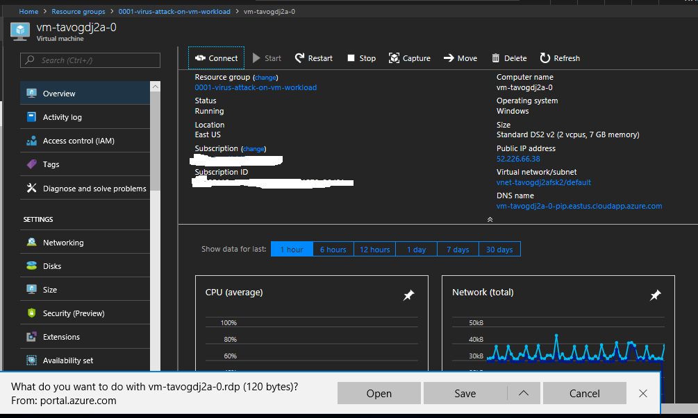
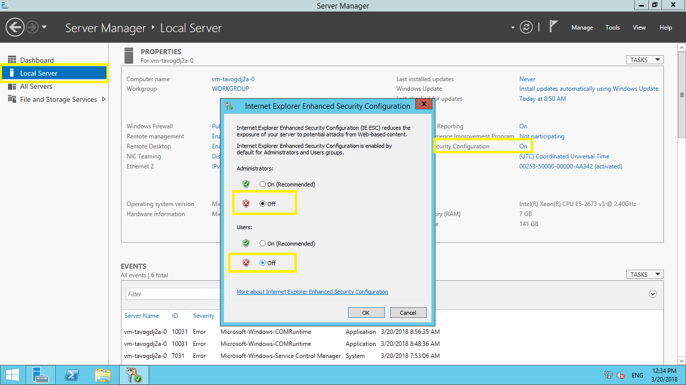
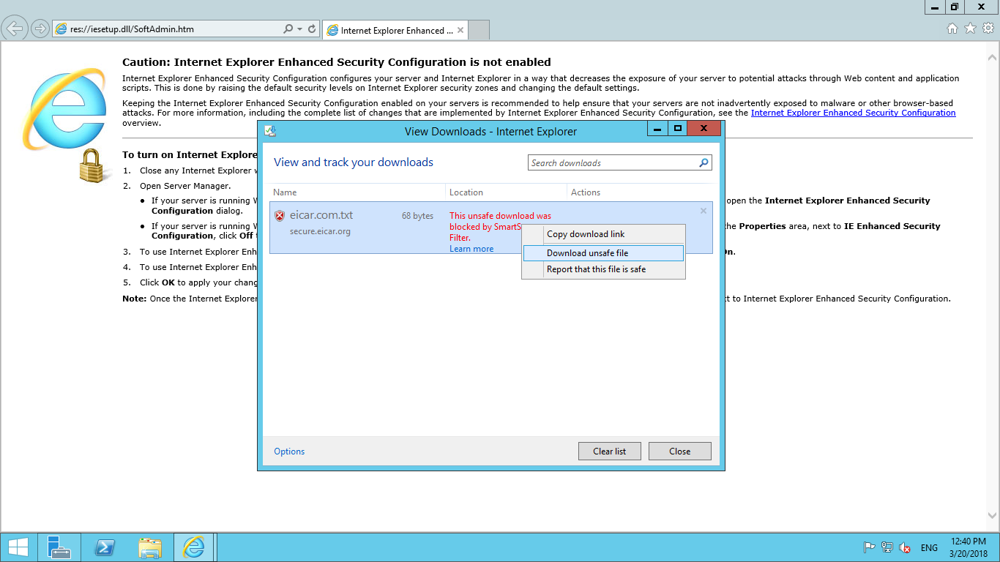
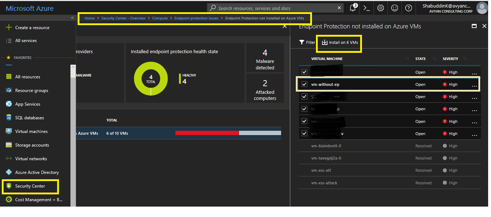
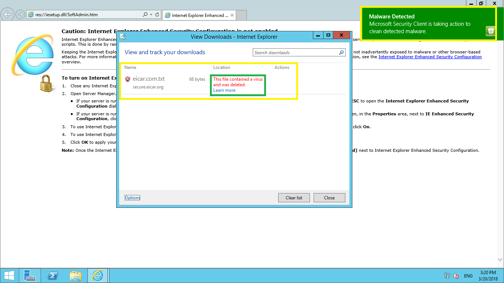
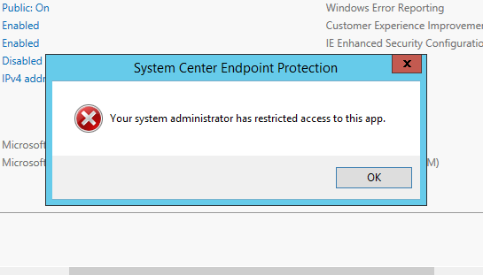
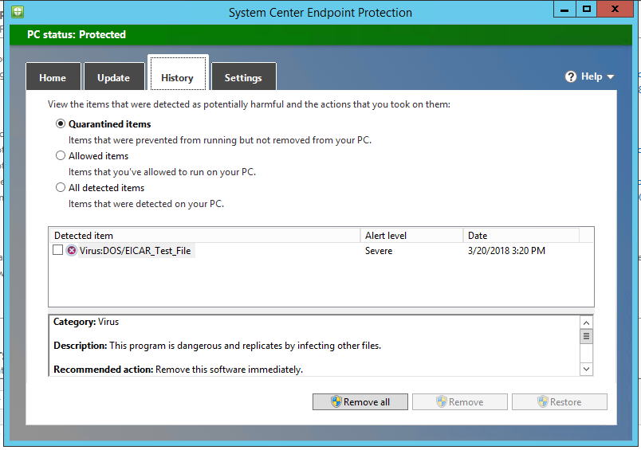
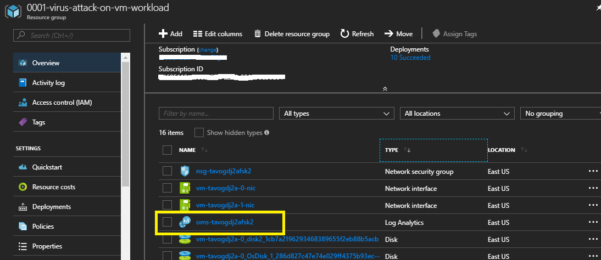
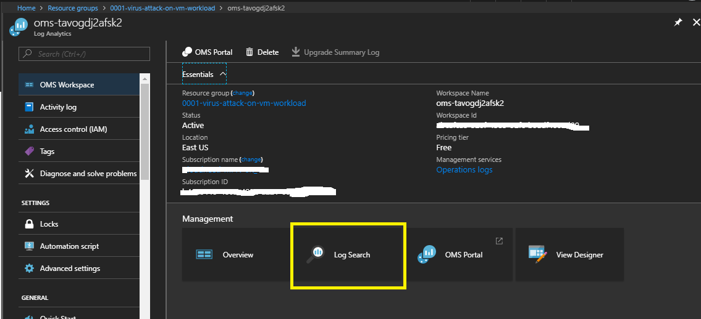
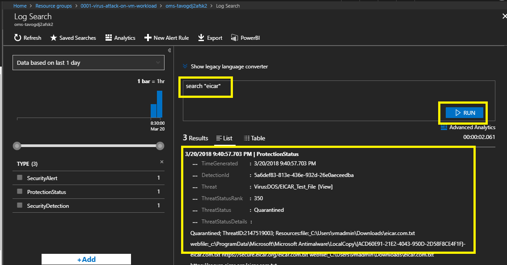

# Virus attack on Virtual Machines Scenario

# Table of Contents
1. [Objectives](#objectives)
2. [Overview](#overview)
3. [Pre-requisites](#prerequisites)
4. [Deploy](#deployment)
5. [Perform Attack](#attack)
6. [Detect Attack](#detect)
7. [Respond/Mitigate](#mitigate)
8. [Teardown Deployment](#teardown)

# Objective of the POC 
Showcase a Virus attack on a Virtual Machine detection & prevention.

# Overview
It showcases following use cases
1. Perform Virus attack on a Virtual Machine --> 

    * VM without Endpoint Protection

2. Perform Virus attack on a Virtual Machine --> 

    * VM with Endpoint Protection

# Important Notes 
Although the deployment takes 10-15mins, the log aggregation by OMS take a few hours to get configured in the backend. You may not see attack/mitigation logs for detection and prevention events during the aggregation time window.   
Subsequently logs will take 10-15 mins to reflect in OMS.

Current powershell version in Azure cloudshell is in preview mode.

# Prerequisites
Access to Azure subscription to deploy following resources 
1. Virtual Machine
2. OMS (Monitoring)

# Deploy

1. Go to Edge Browser and Open [Azure Cloud Shell](https://shell.azure.com/)
1. Change directory to CloudDrive directory 

   `cd $Home\clouddrive `

1. Clone the Azure quickstart repository.
   `git clone https://github.com/Azure/azure-quickstart-templates.git`

1. Change directory to azure-security-scenarios
 
   `cd .\101-VM-Virus-Attack-Prevention\`

1. Run the following command to start the deployment.

   `.\Deploy-AzureResourceGroup.ps1 -Verbose`

    If you are running the deployment for the second time and don't want to upload the artifacts just pass SkipArtifactsUpload switch.

   `.\Deploy-AzureResourceGroup.ps1 -Verbose -SkipArtifactsUpload`

# Perform Attack 

Attack on VM without an Endpoint Protection.

1. Go to Azure Portal --> Select Resource Groups services --> Select Resource Group - "prefix-virus-attack-on-vm-workload"

2. Select VM with name 'vm-without-ep'.

    

3. On Properties Page --> Click Connect to Download RDP file --> Save and Open RDP file.

4. Enter login details (The VM login username and password is in deployment powershell output)

5. Open Server Manager and Disable Internet Explorer Enhanced Security Configuration.

6. Open Internet Explorer and Download (https://secure.eicar.org/eicar.com.txt)

7. If IE blocks downloading, Go to View Downloads --> Right Click on File and Select Download Unsafe File.

8. You will notice that Virus file gets downloads successfully on VM indicating attack was successful.

# Mitigate

Azure Security Center gives you recommendations and also allows you to perform remediation steps from the console itself.

1. Go to Home > Security Center - Overview > Compute > Endpoint protection issues > Endpoint Protection not installed on Azure VMs

2. You will notice your VM with name "vm-without-ep" is listed with various other VMs which does not have endpoint protection installed.

3. Select your VM with name "vm-without-ep" and Click on Install on VM. This will install endpoint protection on the VM

# Attack & Detection

Anti-malware Extension (Endpoint Protection) might take 5-10 mins to get installed on a VM. Hence, you will use another VM with name "vm-with-ep" which already has Anti-malware extension installed further for our Demo using loginid and pwd (The VM login username and password is in deployment powershell output)

To perform attack open Internet Explorer and Download (https://secure.eicar.org/eicar.com.txt)

However, this time when you try to download Eicar virus file, it will be immediately detected and will be quarantined by endpoint protection.

## Detection using Endpoint protection client

When you try to access SCEP, you will get restricted access error. 

To access endpoint protection client, you need to clean SCEP Policy on Windows workstation or server.
1. Open **Powershell**
1. Go to 

   `cd "C:\Program Files\Microsoft Security Client"`

1. then run 

   `.\ConfigSecurityPolicy.exe .\CleanUpPolicy.xml`

1. Now, Go to Start --> Type **System Center Endpoint Protection** --> Go to **History** tab on SCEP Client window.
1. You will notice Eicar Test Virus file under Quarantined items.

## Detection using centralised OMS.

1. Go to **Azure Portal** --> navigate to resource group **<case no>-virus-attack-on-vm**

1. Go to **Log analytics** --> Click on **Log Search** --> Type query `search "eicar"`

   

You will notice events related to Quarantined items. It might take few minutes for OMS to pull logs from virtual machine, so if you don't get any search results, please try again after sometime.

    

## Teardown Deployment 

Run following command to clear all the resources deployed during the demo.

`.\scripts\cleanup.ps1 -Verbose`

Verification steps -
1. Login to Azure Portal / Subscription
2. Check if the ResourceGroup is deleted.

References -

http://www.eicar.org/

https://docs.microsoft.com/en-us/azure/security/azure-security-antimalware

https://docs.microsoft.com/en-us/azure/operations-management-suite/operations-management-suite-overview

