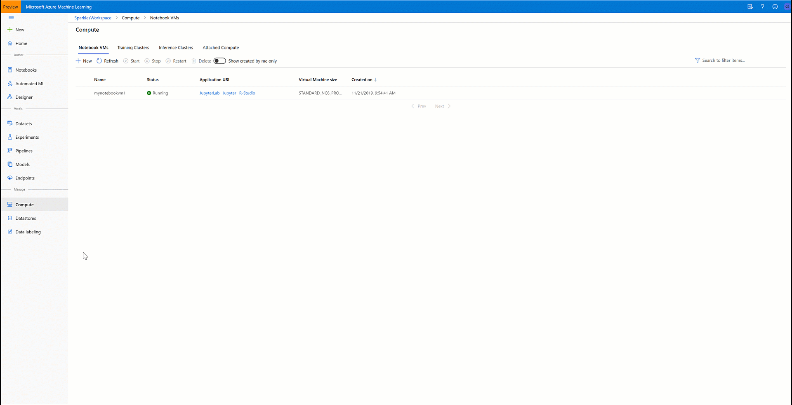
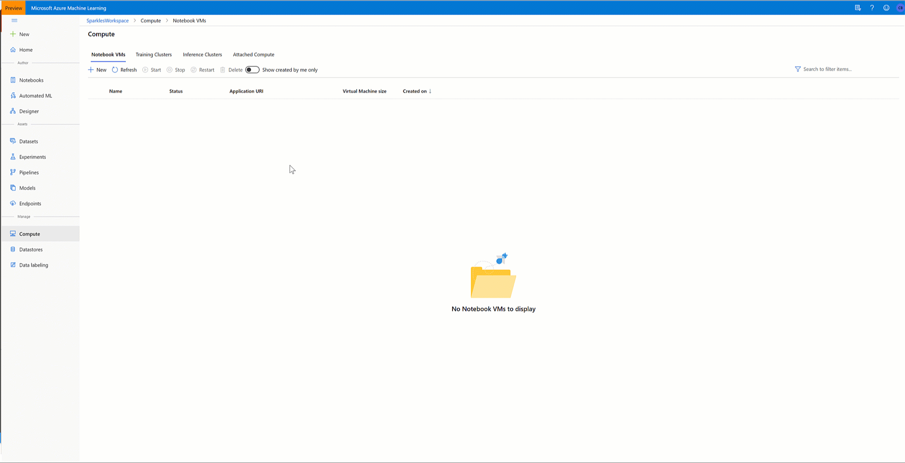
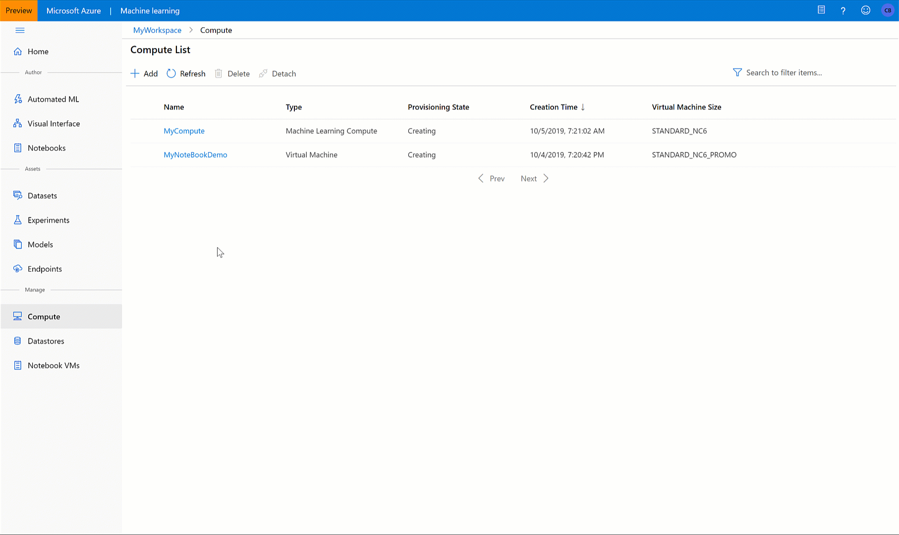

# Create Azure Machine Learning Services Resources with the Deploy to Azure Button below

## Create Additional Resources Needed

Once you have created the base Azure Machine Learning Service Workspace we need to add additional compute resources.

## Create Compute Targets

### Create Machine Learning Compute

- Click on the nav Compute
- Click New
- Enter a name for the resource
- Select Machine Learning Compute from the dropdown
- Select the machine size
- Enter the min and max nodes (recommend min of 0 and max of 5)
-Click Create Create Compute

### Create Notebook Virtual Machine

- Click on the Notebook VM nav
- Click New
- Give the notebook a unique name
- Select the VM size (NC6 is always good)
- Click Create Create VM
- Optional Kuberetes Cluster

### Create Kubernetes Compute

- Click on the nav Compute
- Click New
- Enter a name for the resource
- Select Kubernetes Service from the dropdown
- Click Create Create Kubernetes
- Retrieve important information

In order to run the demos you will need to retrieve the following information:

subscription id: You can get this by going to <azure.portal.com> and logging into your account. Search for subscriptions using the search bar, click on your subscription and copy the id.
resource group: the name of the resource group you created in the setup steps
compute target name: the name of the compute target you created in the setup steps
Make sure to never commit any of these details to Git / GitHub

### Resources

[Azure Machine learning](https://azure.microsoft.com/services/machine-learning )
[Create development environment for Machine learning](https://docs.microsoft.com/azure/machine-learning/service/how-to-configure-environment)
[Hyperparameter tuning in AML](https://docs.microsoft.com/azure/machine-learning/service/how-to-tune-hyperparameters)
[AML Python SDK](https://docs.microsoft.com/azure/machine-learning/service/how-to-configure-environment)
[AML Pipelines](https://docs.microsoft.com/azure/machine-learning/service/how-to-create-your-first-pipeline)
[Getting started with Auto ML](https://docs.microsoft.com/azure/machine-learning/service/concept-automated-ml)
[Intro to AML – MS Learn](https://docs.microsoft.com/en-us/learn/modules/intro-to-azure-machine-learning-service)
[Automate model select with AML - MS Learn](https://docs.microsoft.com/en-us/learn/modules/automate-model-selection-with-azure-automl)
[Train local model with AML - MS Learn](https://docs.microsoft.com/en-us/learn/modules/train-local-model-with-azure-mls)
