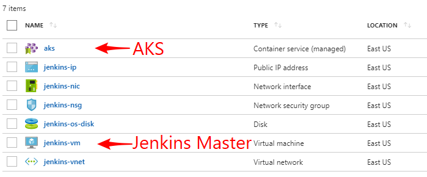
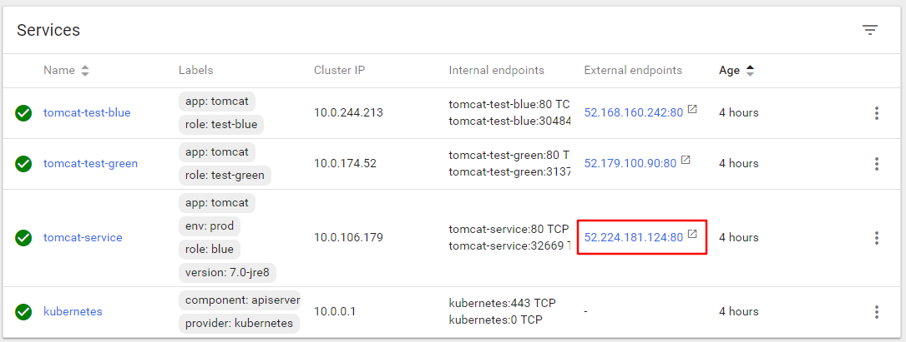

# Jenkins Blue-Green Deployment on Kubernetes

<a href="https://portal.azure.com/#create/Microsoft.Template/uri/https%3A%2F%2Fraw.githubusercontent.com%2FArieShout%2Fazure-quickstart-templates%2Fblue-green%2F301-jenkins-k8s-blue-green%2Fazuredeploy.json" target="_blank">
    
</a>
<a href="http://armviz.io/#/?load=https%3A%2F%2Fraw.githubusercontent.com%2FArieShout%2Fazure-quickstart-templates%2Fblue-green%2F301-jenkins-k8s-blue-green%2Fazuredeploy.json" target="_blank">
    
</a>

This template provisions a Jenkins master running in a VM on Azure; configures a DevOps pipeline based on
two public Tomcat Docker images and deploys to [AKS (Azure Container Service)](https://azure.microsoft.com/en-us/services/container-service/).
It is an example to demonstrate how we can use Jenkins pipeline to do blue-green deployment on AKS.

The quickstart template will provision the following resources in Azure:

* A Jenkins master running on a Linux Ubuntu 16.04 LTS VM in Azure. The instance is pre-configured with
   the Azure Service Principal credential you provide. This credential is used to manage the Azure resources.
* A basic pipeline that demonstrates the steps to do blue-green deployment to Kubernetes:

   1. Prepare two similar environments:

      * **Blue** with image `tomcat:7.0-jre7`
      * **Green** with image `tomcat:8.0-jre8`

      ***Note***: in real world projects, provisioning of the environment is likely to be done outside of
      the continuous integration pipeline. We included this in the pipeline to make the quickstart configurations
      easier to manage.

   1. Deploy new application to one of the environments. The example starts with "Green" if nothing
      has been deployed before.
   1. Verify that the Green environment is working as expected through the test endpoint.
   1. Update the application public endpoint to route the traffic to "Green" environment.
   1. Verify that the public endpoint is working properly with the "Green" environment serving as backend.

**Note**: At the time when this quickstart is created, AKS is in preview. You may need to enable the preview
for your Azure subscription. Please refer to https://docs.microsoft.com/en-us/azure/aks/kubernetes-walkthrough#enabling-aks-preview-for-your-azure-subscription
for more details.

## How to try it out

### Prerequisites

* An Azure subscription.
* An Azure Service Principal to manage the related Azure resources.
* An SSH key pair that will be used to login remotely to the Jenkins master VM and the ACS master node.

### Steps

1. Click the **Deploy to Azure** button from above, this will lead you to the ARM provision page.
1. Fill in the parameters, agree to the terms & conditions and click Purchase. It takes about 20 minutes
   for the provision process to complete. Once the deployment is complete, the resource group contains
   all resources for the Jenkins master and the AKS cluster:

   

1. Check in the resource group, then then click `Deployments` to find the latest deployment with the name
   `Microsoft.Template`, the following details will be displayed in the *Outputs* section:
   * `ADMINUSERNAME`: The Admin username for the Jenkins master VM, which is the one you filled in the provision page
   * `DEVOPSVMFQDN`: The host name of the Jenkins master VM
   * `JENKINSURL`: The Jenkins URL
   * `SSH`: The SSH command to create a tunnel through which you can login and manage the Jenkins instance
      securely
   * `KUBERNETESMASTERFQDN`: The host name of the ACS Kubernetes master node
1. Run the command listed in the `SSH` box. Check the Jenkins admin password by running the following command
   in the SSH session:

   ```sh
   sudo cat /var/lib/jenkins/secrets/initialAdminPassword
   ```

1. Visit http://localhost:8080, login with the admin password.
1. Follow the instructions to setup the Jenkins instance.
1. You can access the AKS cluster by doing the following from your local machine.

   > **Note**: 	You need Azure CLI version 2.0.21 or later for AKS.
   > Refer to https://docs.microsoft.com/en-us/cli/azure/install-azure-cli?view=azure-cli-latest#update-the-cli 
   > if you need to update your installation.

   In command line:

   ```sh
   az login
   az aks get-credentials \
       --resource-group <yourResourceGroup> \
       --name containerservice-<yourResourceGroup> \
       --admin
   ```

   To verify the connection to your cluster, use the `kubectl get` command.

   

   ```sh
   kubectl proxy
   ```

   Type http://localhost:8001/ui in your browser to get to the Kubernetes Web UI (Dashboard.) Since nothing
   has been provisioned, it is not too exciting yet.

   

   ***Note***: In recent version of Kubernetes, the dashboard UI redirection seems to be broken. If you see
   blank page after the server redirection, add a trailing slash `/` to the redirected address in the
   address bar.

1. Go back to your Jenkins master dashboard, you should see a job **AKS Kubernetes Blue-green Deployment**.
1. Start the build. The build process may take several minutes for the first time, as the backend Kubernetes
   needs to provision the Azure load balancer for the test and public endpoints for the services.

   *Again, generally, this should be prepared outside of the deployment pipeline. We include them in the pipeline
   to make the quick start template easier to manage.*

1. While waiting for the build to complete, you can go back to Kubernetes Dashboard and click **Services**.
   `tomcat-test-blue` and `tomcat-test-green` start showing up.

   

1. When the Jenkins job finishes, verify the Green environment has been switched over to the public
   service endpoint, click the external endpoint for `tomcat-service`.

   

   The version shown is Tomcat/8.0.47.

   

1. If you run the build more than once, it will cycle through BLUE and GREEN deployments. i.e., if the current
   environment is **Green**, the job will deploy/test the **Blue** (Tomcat 7) environment and then update
   the application public endpoint to route traffic to the **Blue** environment if all is good with testing.

   **Note**: In the deployment pipeline, we always deploy the ***SAME*** image to a given environment in later builds.
   This is just for demonstration on updating the environment. In real world projects, we would build a new image
   with the latest project artifacts installed, update the image reference in the deployment config and deploy it
   to the target environment.
