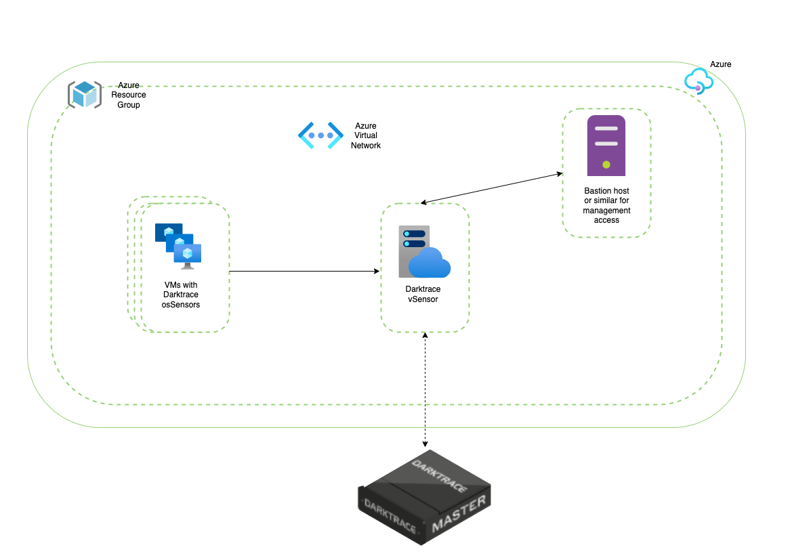
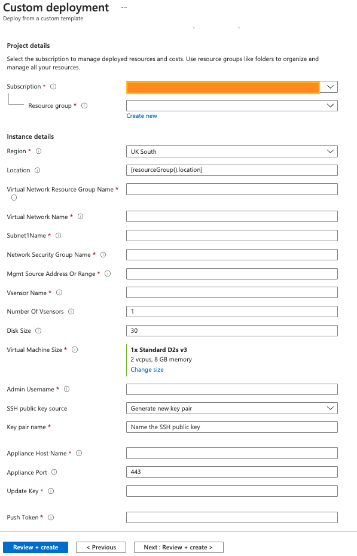
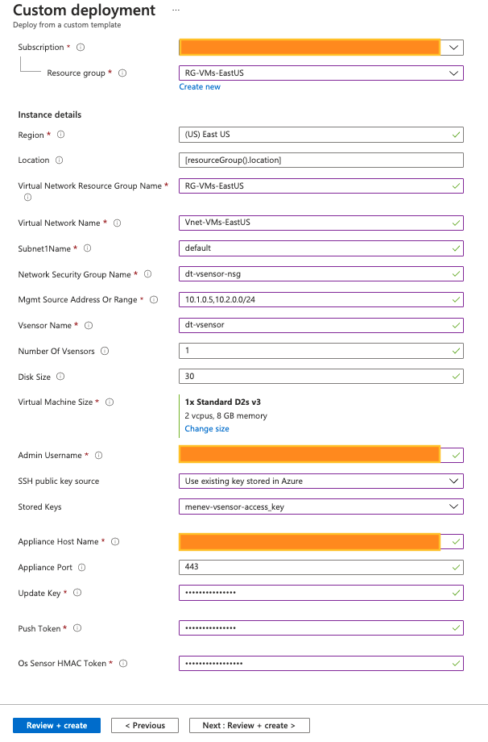
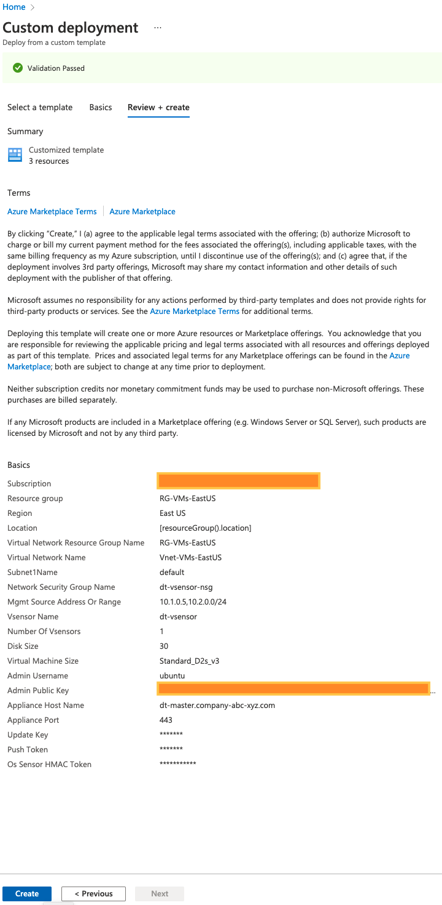
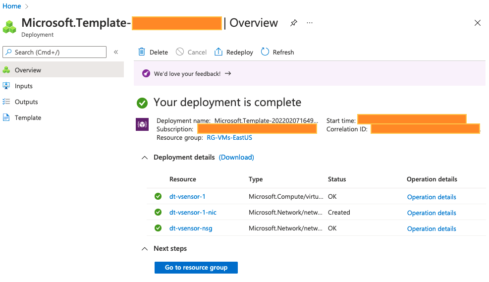

# Deploy Darktrace vSensors


[](https://portal.azure.com/#create/Microsoft.Template/uri/https%3A%2F%2Fraw.githubusercontent.com%2FAzure%2Fazure-quickstart-templates%2Fmaster%2Fapplication-workloads%2Fdarktrace-vsensor-standalone%2Fazuredeploy.json)
[](https://portal.azure.us/#create/Microsoft.Template/uri/https%3A%2F%2Fraw.githubusercontent.com%2FAzure%2Fazure-quickstart-templates%2Fmaster%2Fapplication-workloads%2Fdarktrace-vsensor-standalone%2Fazuredeploy.json)
[](http://armviz.io/#/?load=https%3A%2F%2Fraw.githubusercontent.com%2FAzure%2Fazure-quickstart-templates%2Fmaster%2Fapplication-workloads%2Fdarktrace-vsensor-standalone%2Fazuredeploy.json)

vSensor introduction
-------------------

This document intends to describe how to use the provided ARM template to deploy one or more standalone Darktrace vSensors in Microsoft Azure.

**Note**: A more advanced, autoscaling version of this template is also available [here](https://github.com/Azure/azure-quickstart-templates/tree/master/application-workloads/darktrace/darktrace-vsensor-autoscaling)

The Darktrace vSensor is a lightweight virtual probe intended for deployment in cloud-based networks or environments where it is not feasible to deploy a physical probe, such as virtualized networks. In an Azure public cloud environment, vSensors can be deployed as standalone virtual machines that collect packets from osSensor agents deployed on the VMs that are to be monitored.

In addition to processing and transmitting network traffic, vSensors can ingest and forward syslog-format logs to the Darktrace master instance. VPN and DHCP logs can provide valuable device-tracking enrichment and custom event types derived from ingested log data can be used to integrate with a number of third-party tools.

_What is unique about the Azure environment?_

**Stand-alone Darktrace vSensors architecture**



**osSensors**

In Microsoft Azure, the configuration and maintenance of the virtual switches is automated and removed from the user’s control.  As a result of this lack of access, a direct SPAN cannot be setup from the virtual switch to the vSensor.

In this environment, the Darktrace osSensor, a lightweight, host-based server agent, is used to send a feed from all monitored VMs directly to the vSensor.

These osSensors can be quickly and simply installed manually. However, for large environments there are a number of tools that can be used to facilitate the deployment of osSensors in bulk such as Ansible, Terraform and Run Commands. For an in-depth guide on using each of these, please see the relevant documentation.

**VNets**

In Microsoft Azure, all VMs are separated into virtual networks (VNets) which are logically separated from each other. A vSensor must be placed in each VNet to ensure total coverage of your Azure environment.

It is possible for VNets to be ‘peered’ and for data to be sent across VNets, thus reducing the number of vSensors needing to be deployed. However, this should be carefully considered before implementing as cross regional data transfer can incur a significant financial cost, as well as potential legal and compliance issues surrounding data residency.

How the template works
-------------------

This ARM Template can be used for deploying Darktrace vSensor in Microsoft Azure.

In brief, the template will perform the following:
* Spin up the requested number of compatible base OS VMs in the existing vNet.
* Automatically download and install the Darktrace vSensor.
Note: For this a valid Darktrace Update Key is required. Please contact your Darktrace representative if you do not possess this.
* The newly installed vSensor will self-configure. As part of the configuration the vSensor will automatically:
    * Connect and register to the Darktrace master instance (virtual/physical) using the Push Token that has already been generated (on the same master instance)
    * Add the osSensor HMAC Token to allow osSensors to authenticate to the new vSensor.

Considerations
-------------------

##### Manual post-checks

The template uses the process described in ‘Custom data and cloud-init on Azure Virtual Machines’ to automate the installation and configuration of the Darktrace vSensor on top of the base OS. This can be found for reference at https://docs.microsoft.com/azure/virtual-machines/custom-data.

The documentation states the following limitation:
_‘if errors happen during execution of the configuration processing or scripts when cloud-init is processing the custom data, that's not a fatal provisioning failure’_

Therefore, if a failure occurs during the automated vSensor installation or configuration, the deployment will NOT fail. The expected resources will be created but there remains a possibility the vSensor has not been installed and configured successfully.

Manual post-checks are currently recommended to mitigate this.

Pre-deployment requirements
-------------------

##### Virtual Network

The template should be used to deploy vSensor(s) in an existing Virtual Network (VNet) and an existing subnet.

##### Resource Group
The Resource Group (RG) is where the new resources’ metadata will be stored. A pre-existing RG may be selected for this purpose, and is an optional requirement. The template will create a RG if one is not provided.

##### Network Security Group
The template will create a new Network Security Group (NSG) that, amongst other rules, will enable access for management from the IP addresses and/or IP Ranges specified when deploying the template.

##### VM size and VM disk size
The VM size should be decided based on the vSensor Requirements as described in the ‘Example Sizings’ in the below link:
https://customerportal.darktrace.com/product-guides/main/vsensor-requirements

When choosing the VM disk size the same ‘Example Sizings’ table can be used. Bear in mind that bigger disk size means larger PCAP storage.

Note that, vSensor performance will vary by CPU speed and the nature of the traffic - estimated sizings are provided for guidance only.

##### Admin User Public Key for ssh authentication
A pre-existing pair private/public key for ssh access is required where the public key will be used by the template to configure the newly created user on the vSensor.

##### Automated vSensor installation and Configuration
For the automated vSensor installation please make sure that:
*	The newly created VM has access to packages.darktrace.com and packages-cdn.darktrace.com on port 443/TCP
*	You already have the Darktrace Update Key

Follow the vSensor-FAQ link for more information regarding the above two requirements:
https://customerportal.darktrace.com/product-guides/main/vsensor-faq

##### Communication between the vSensor and the Darktrace master instance (virtual/physical)
To connect and register the vSensor to the Darktrace master instance the following is required:
* The Darktrace master instance’s FQDN or IP and port
* The push token (generated on the Darktrace master instance System Config page)
* Access to the master instance’s FQDN or IP and port

##### Pre-Configured osSensor HMAC
The template will expect the osSensor HMAC Token to be provided so it can configure it as part of their automated configuration.

##### Access to the vSensor
The vSensors created will not have public IP associated. Exposing a vSensor via a public IP carries additional security burden and is not a requirement of push token authentication with the master instance.

It is expected that there is already a solution in place to access the VMs in the VNet via their private IP, for example via Azure Bastion Host.

If there is a virtual firewall on your network, please ensure access is granted to the vSensor to the Darktrace instance FQDN/port or IP/port, as well as to packages.darktrace.com and packages-cdn.darktrace.com on port 443.

Provide values for the required parameters
-------------------

* The template should appear as a form that expects values for input parameters (with some pre-populated):



* Parameters description

Note: all parameters are necessary.

| Parameter name | Description |
| ------ | ------ |
| Subscription | Choose the Subscription to use for this deployment. |
| Resource Group | Choose a pre-existing RG or create a new RG; all metadata for the resources created as part of this deployment will be stored in this RG. |
| Region | This should be set to the the RG’s region. |
| Location | Where the new resources will reside. Default is the same as the RG Region. <br><br> _Default value_: **[resourceGroup().location]** |
| virtualNetworkName | Name of the Virtual Network, should be in the above **Location** otherwise the deployment will fail. |
| virtualNetworkResourceGroup | The Resource Group the VNet is deployed in.|
| subnet1Name | Name of the Subnet in the Virtual Network (parameter **virtualNetworkName**).|
| networkSecurityGroupName | Name for the Network Security Group that the template will create. Note that a pre-existing Network Security Group with the same name **will be replaced**. |
| MgmtSourceAddressOrRange | An address range using CIDR notation (e.g. 10.1.0.0/24), or an IP address (e.g. 192.168.99.21) for Management access via ssh (port 22/TCP). A comma-separated list of IP addresses and/or address ranges is also accepted (a valid comma-separated list would be 10.1.0.4,10.2.1.0/24). To allow access from any IP use 0.0.0.0/0. |
| vsensorName | The name of the vSensor. The VM names will have suffix ‘-N’ where N is a number from 1 to _**numberOfVsensors**_ (see below). |
| numberOfVsensors | Number of vSensors to be deployed, max is 4. <br><br> _Default value_: **1** |
| diskSize | The vSensor OS disk size in GB between 30 and 1024. <br><br> _Default value_: **30** |
| virtualMachineSize | vSensor VM Size. For more information regarding the Virtual Hardware Requirements please visit https://customerportal.darktrace.com/product-guides/main/vsensor-requirements <br><br> _Default value_: **Standard_D2s_v3** |
| adminUsername | Username to be created when the vSensor is spun up. Note that password authentication over ssh for newly created VMs is disabled. |
| adminPublicKey | Public key for the adminUsername user to ssh the vSensor. |
| applianceHostName | The FQDN or the IP of the Darktrace master instance (virtual/physical). |
| appliancePort | Darktrace master instance connection port. <br><br> _Default value_: **443** |
| updateKey | Darktrace Update Key needed to install the vSensor package. Contact your Darktrace representative for more information. |
| pushToken | The push token that vSensor will use to connect and register on the Darktrace master instance. Should be generated on the Darktrace master instance. |
| osSensorHMACToken | The osSensor HMAC Token. |

There is an example in **[Appendix A](#appendix-a-examples)**.

Post deployment checks
-------------------

As stated under the Considerations section – it is recommended to perform a health check on successful template deployment.
Once the deployment has completed successfully, connect to the vSensor(s) and verify the vSensor configuration and health by running:

```
$ sudo confconsole
```

And then follow the menu. More details on options available can be found on the Darktrace Customer Portal.

Additional information about the Resources that the template will create
-------------------

#### vSensor

A number of VMs can be spun up that will then be automatically installed and configured as Darktrace vSensors.

* Each will have a single NIC and a private IP.
* The VM size can be any (selectable by the customer) that meets the Virtual Hardware Requirements. The requirements can be found on the Customer Portal (https://customerportal.darktrace.com/product-guides/main/vsensor-requirements).
* The OS will be the latest version of Ubuntu 20_04-lts (Gen2).
* The VM OS disk will be StandardSSD_LRS; its size is between 30GB and 1024GB (configurable by input parameter).
* The vSensors will have a newly created Network Security Group to limit the access to the vSensor. Details can be found in the ‘Network Security Group’ below.
* The vSensor will have the provided user name (input parameter) created and its ssh public key added (input parameter).
* The template will automatically install and configure the Darktrace vSensor software.
* The template will automatically connect and register the vSensor with the Darktrace master instance (virtual/physical).
* The template will ensure the osSensor HMAC is configured on the vSensor so the osSensors are able to connect to the vSensors.

#### Network Security Group

The template will create a new NSG.

* The new NSG name should be provided (this is one of the parameters).
    * If NSG with the same name exists in the RG, and the (RG) Region and the (deployment) Location are the same, then the existing NSG will be replaced with the new one.
    * If NSG with the same name exists in the RG but the RG Region and the (deployment) Location are not the same then the deployment will fail.
* Three Inbound rules will be added that will have precedence over the default rules:
    * Port 22/TCP allow access from the provided management IPs/Ranges only.
    * Ports 80/TCP and 443/TCP allow access from any VM within the VNet.
    * Deny all other Inbound.
* The template will not create any Outbound rules and will leave the default Outbound rules (the vSensor will have Outbound access to everywhere).

#### Resource Group

The template can create a new RG, or it can use a pre-existing RG.

Appendix A - Examples
-------------------

#### Create vSensors in a pre-existing RG

In this example the VNet (which is pre-existing) is in a different Resource Group than the RG for this deployment.

* Template input parameters



* Deployment validation



* Deployment completed - overview



* Deployment completed - outputs


`Tags: Microsoft.Network/networkSecurityGroups, Microsoft.Network/networkInterfaces, Microsoft.Compute/virtualMachines`
