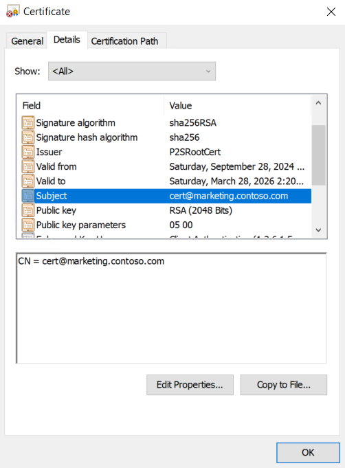
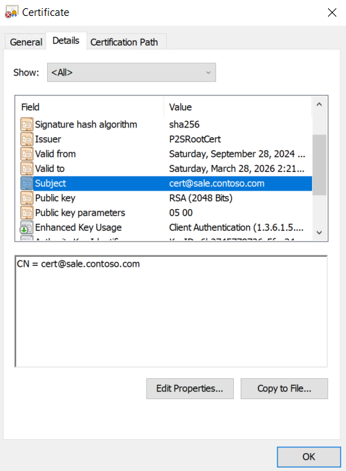
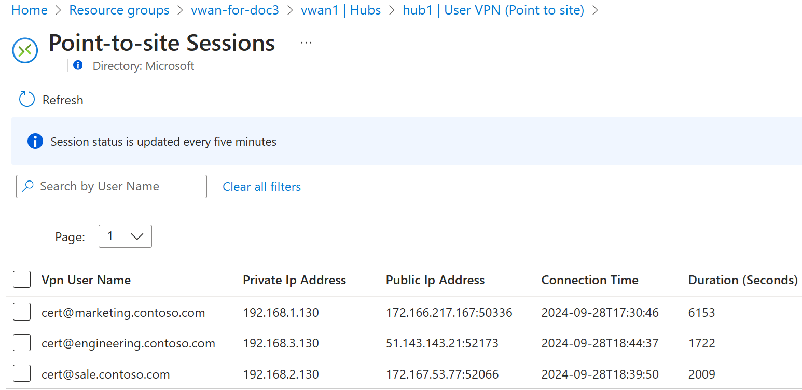

# Azure vWAN with Point-To-Site connections configured with user groups and multiple address pool


[](https://portal.azure.com/#create/Microsoft.Template/uri/https%3A%2F%2Fraw.githubusercontent.com%2FAzure%2Fazure-quickstart-templates%2Fmaster%2Fquickstarts%2Fmicrosoft.network%2Fvirtual-wan-multiple-address-pool%2Fazuredeploy.json)

[](http://armviz.io/#/?load=https%3A%2F%2Fraw.githubusercontent.com%2FAzure%2Fazure-quickstart-templates%2Fmaster%2Fquickstarts%2Fmicrosoft.network%2Fvirtual-wan-multiple-address-pool%2Fazuredeploy.json)

## Overview

This template provisions an Azure Virtual WAN with a single hub, featuring **Point-to-Site connections configured with user groups and multiple address pools.**

## Description

This ARM template provisions an Azure Virtual WAN (vWAN) environment with the following resources:

- a single hub,
- two Azure Virtual Networks (VNets): spoke1 and spoke2
- two VNet connections for the vWAN hub: cone connecting to spoke1 VNet and the other to spoke2 VNet. Both VNet connections are associated with the routing table 'RT_SPOKE' and propagated to the 'RT_SPOKE' and default routing tables.
- A Point-to-Site (P2S) VPN gateway is configured with multiple user groups and multiple address pools. All the P2S connections are authenticated using digital certificates.


The ARM template creates a Point-to-Site server configuration named **hub1_P2SvpnServerConfiguration** with the following setting:

| group configuration name  | Default | Priority | Group Name  | Authentication Type   | group configuration value|
|---------------------------|---------|----------|-------------|-----------------------|--------------------------|
|hub1_P2SvpnServerConfigGrp1| true    | 0        | Marketing   | Certificate: Group ID | marketing.contoso.com    |
|hub1_P2SvpnServerConfigGrp2| false   | 1        | Sale        | Certificate: Group ID | sale.contoso.com         |
|hub1_P2SvpnServerConfigGrp3| false   | 2        | Engineering | Certificate: Group ID | engineering.contoso.com  |

All three user groups are authenticated using digital certificates. The Marketing group is set as the default group. <br>
If there is no match between the **Subject** in the client's digital certificate and the **group configuration value**, the VPN Gateway will assign the client an IP address from the default group. <br> The Point-to-Site server configuration **hub1_P2SvpnServerConfiguration** is associated with hub1, and each group configuration is linked to a specific address pool:

| group configuration name  | Address pool   |
|---------------------------|----------------|
|hub1_P2SvpnServerConfigGrp1| 192.168.1.0/24 |
|hub1_P2SvpnServerConfigGrp2| 192.168.2.0/24 |
|hub1_P2SvpnServerConfigGrp3| 192.168.3.0/24 |

<br>


<br>

IP addressing scheme is specified by variables within the template. <br>
In P2S with authetication with digital certificate, the root certificate is used to sign the client certificates.  <br>
The ARM template requires the mandatory specification of public certificate data of the root certificate. Without the root certificate data, the deployment will fail. 
After the provisioning, checking the Point-to-Site configuration requires three different P2S clients. <br>
The steps to connect in P2S the clients to vWAN:

- Create three different digital certificates client signed by root certificate.
- Load the three P2S client digital certificates (Marketing, Sales, Engineering) onto the P2S clients.
- Download and install the Azure VPN client on the P2S clients.
- Download the user profile from the Azure management portal and copy it to each client.
- Open the Azure VPN client on the P2S clients and import the user profile.
- In the Azure VPN client, select the imported user profile and connect to the vWAN

More details about multiple address pools and user groups can be found in the documentation:

[About client address pools for Virtual WAN point-to-site configurations](https://learn.microsoft.com/azure/virtual-wan/about-client-address-pools) <br>
[Configure user groups and IP address pools for P2S User VPNs](https://learn.microsoft.com/azure/virtual-wan/user-groups-create)

To create the digital certificates for test environments, you can use the powershell script **create-root-and-clients-certificates.ps1** from the root of this repo:

```powershell
.\create-root-and-clients-certificates.ps1 'PASSWORD-TO-EXPORT-DIGITAL-CERTIFICATE'
```
The powershell scripts generate the following certificates for the clients:






Point-to-site sessions between three clients in different users group :



`Tags: vWAN, Virtual WAN, VPN, P2S, multiple address pool, user group, Microsoft.Network/virtualWans, Microsoft.Network/virtualHubs, Microsoft.Network/virtualNetworks, Microsoft.Network/virtualHubs/hubVirtualNetworkConnections, Microsoft.Network/vpnGateways, Microsoft.Network/vpnServerConfigurations, Microsoft.Network/p2sVpnGateways`