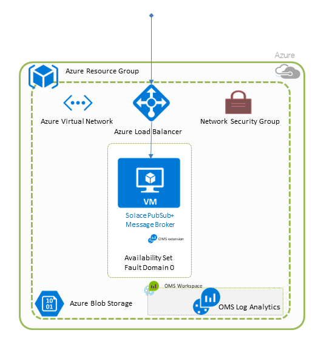
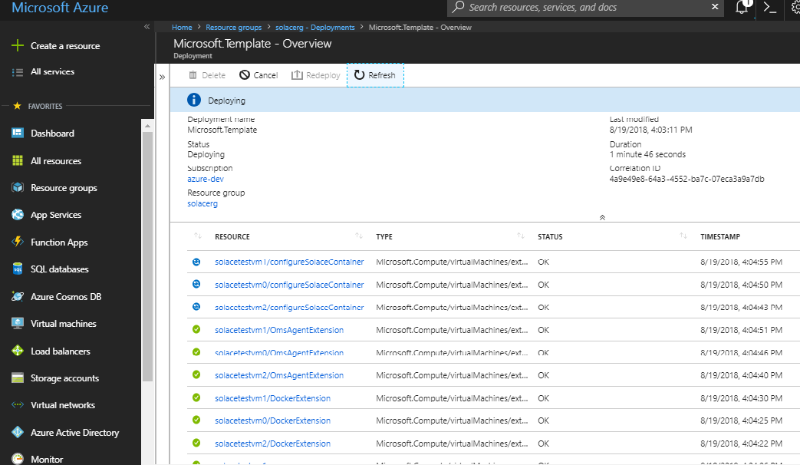
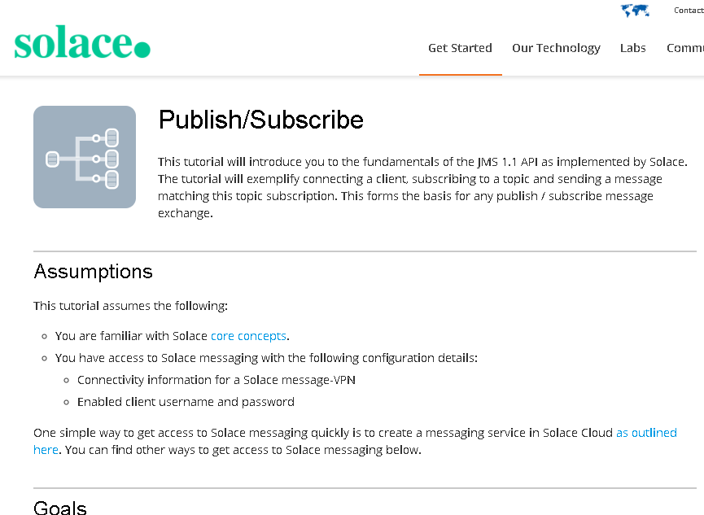

[](https://travis-ci.org/SolaceProducts/solace-azure-quickstart-template)

# How to Deploy Standalone or HA Clusters of Solace PubSub+ Software Message Brokers onto Azure

&nbsp;
&nbsp;

&nbsp;
&nbsp;

&nbsp;
&nbsp;

The Solace PubSub+ software message broker meets the needs of big data, cloud migration, and Internet-of-Things initiatives, and enables microservices and event-driven architecture. Capabilities include topic-based publish/subscribe, request/reply, message queues/queueing, and data streaming for IoT devices and mobile/web apps. The message broker supports open APIs and standard protocols including AMQP, JMS, MQTT, REST, and WebSocket. As well, it can be deployed in on-premise datacenters, natively within private and public clouds, and across complex hybrid cloud environments.


How to Deploy a Solace PubSub+ Software Message Broker
-------------------

Message brokers can be deployed in three node HA clusters or as single, standalone nodes. For simple test environments that only need to validate application functionality, a single instance will suffice.



Note that in production, or any environment where message loss cannot be tolerated, an HA cluster is required.


This is a two step process:

### Step 1: 

Obtain a reference to the Docker image of the Solace PubSub+ message broker to be deployed

First, decide which [Solace PubSub+ message broker](https://docs.solace.com/Solace-SW-Broker-Set-Up/Setting-Up-SW-Brokers.htm ) and version is suitable to your use case.

The Docker image reference can be:

*	A public or accessible private Docker registry repository name with an optional tag. This is the recommended option if using PubSub+ Standard. The default is to use the latest message broker image [available from Docker Hub](https://hub.docker.com/r/solace/solace-pubsub-standard/ ) as `solace/solace-pubsub-standard:latest`, or use a specific version [tag](https://hub.docker.com/r/solace/solace-pubsub-standard/tags/ ).

*	A Docker image download URL
     * If using Solace PubSub+ Enterprise Evaluation Edition, go to the Solace Downloads page. For the image reference, copy and use the download URL in the Solace PubSub+ Enterprise Evaluation Edition Docker Images section.

         | PubSub+ Enterprise Evaluation Edition<br/>Docker Image
         | :---: |
         | 90-day trial version of PubSub+ Enterprise |
         | [Get URL of Evaluation Docker Image](http://dev.solace.com/downloads#eval ) |

     * If you have purchased a Docker image of Solace PubSub+ Enterprise, Solace will give you information for how to download the compressed tar archive package from a secure Solace server. Contact Solace Support at support@solace.com if you require assistance. Then you can host this tar archive together with its MD5 on a file server and use the download URL as the image reference.

### Step 2: 

Hit the "Deploy to Azure" button, and in the deployment template add the link to the Solace PubSub+ software message broker. 

<a href="https://portal.azure.com/#create/Microsoft.Template/uri/https%3A%2F%2Fraw.githubusercontent.com%2FSolaceProducts%2Fsolace-azure-quickstart-template%2Fmaster%2Fazuredeploy.json" target="_blank">
    
</a>
<a href="http://armviz.io/#/?load=https%3A%2F%2Fraw.githubusercontent.com%2FSolaceProducts%2Fsolace-azure-quickstart-template%2Fmaster%2Fazuredeploy.json" target="_blank">
    
</a>

You need to fill in the following fields (* marks the mandatory ones):

| Field                      | Value                                                                          |
|----------------------------|--------------------------------------------------------------------------------|
| **BASICS**                 |  |
| Subscription*              | Provide your subscription to use. |
| Resource Group*            | A new group, or an existing group that will be available from the pull-down menu once "Use existing" is selected. |
| Location*                  | Specify a location for the resource group where metadata about the resources is stored. Select the region most suitable to you. |
| **SETTINGS**               |  |
| Admin Username*            | Username for the virtual Machine(s) hosting the Solace message router instance(s). Do not use special characters. |
| Admin Password*            | Password for the virtual Machine(s) and for the 'admin' management user. Azure sets rules on passwords, observe the online feedback. |
| Security Group Name        | New or existing security group, where message broker default ports will be made publicly available. |
| Workspace Name             | New or existing OMS Log Analytics workspace, where logs and diagnostics are monitored. Leave this field empty to not deploy an OMS Workspace. |
| Workspace Region           | Select region to deploy OMS Log Analytics workspace. Not used if Workspace Name is empty. |
| DNS Label for LB IP*       | Used for the public DNS name of the Load Balancer. |
| DNS Label for VM IP        | Used for the public DNS name of each Virtual Machine. The default offers to generate a unique name. |
| CentOS Version             | The CentOS version for deploying the Docker containers. Use CentOS 7.2, 7.3, or 7.4. |
| Message Routing VM Size     | The size of the VM for the message routing nodes. Use Standard_D2_v2, Standard_DS2_v2, Standard_D2_v3, or Standard_D2s_v3. Note that not all regions support all these VM sizes. |
| Monitor VM Size            | The size of the VM for the monitoring node. Use Standard_D2_v2, Standard_DS2_v2, Standard_D2_v3, or Standard_D2s_v3. Note that not all regions support all these VM sizes. |
| Data Disk Size             | The size of the data disk in GB for diagnostics and message spooling on the message brokers. Use 0, 20, 40, 80, or 160. |
| Solace Message Broker Docker image reference | A reference to the Solace PubSub+ message broker Docker image, from step 1. Either the image name with optional tag in an accessible Docker registry or a download URL. The download URL can be obtained from http://dev.solace.com/downloads/ or it can be a URL to a remotely hosted image version. The default value is `solace/solace-pubsub-standard:latest` |
| Deployment Model*          | High Availability or Single Node. |
| Existing Virtual Network Name | Only used if deploying into an existing virtual network and subnet. Specify the Existing Virtual Network Name together with the Existing Subnet Name, otherwise leave it at default blank. |
| Existing Subnet Name       | Only used if deploying into an existing virtual network and subnet. Specify the Existing Virtual Network Name together with the Existing Subnet Name, otherwise leave it at default blank. |
| VNnet Address Prefix       | The virtual network's address range in CIDR notation where the Solace message broker will be deployed. |
| Subnet Prefix              | The subnet's address range in CIDR notation where the Solace message broker will be deployed. It must be contained by the address space of the virtual network. The address range of a subnet which is in use can't be edited. |
| Location                   | The location where all the resources are stored. The default is the same location as the resource group. |
| Number Of Fault Domains    | The number of fault domains to be used for the deployment. For the maximum number fault domains available to your location refer to https://github.com/MicrosoftDocs/azure-docs/blob/master/includes/managed-disks-common-fault-domain-region-list.md |
| _artifactsLocation         | The base URI where artifacts required by this template are located. Leave it at default unless deploying from your own location. |
| _artifactsLocationSasToken | The Shared Access Signatures (SAS) token if required for the artifacts location, otherwise leave it at default blank. |

After completing the template fields and accepting the legal terms, you need to purchase the deployment. The cost will only be related to the Azure instance and storage costs.

Once the deployment has started, you can view its progress under the Resource Groups tab. Select the resource group you have deployed into, then select the correct deployment across the top. You can then scroll down and see its progress.

In this example, the resource group is `solacerg` and the `Microsoft.Template` template is in progress. You can see the VMs `solacetestvm0`, `solacetestvm1`, and `solacetestvm2` have started, the Docker Extensions have been installed on each VM, and the message broker configurations are taking place. Once the message brokers are configured, the primary message broker validates the cluster and signals the deployment as completed. At this point, you can access the message brokers.



In addition to the above resources, the deployment creates an Azure Load Balancer that gives you management and data access to the currently AD-Active message broker.

Microsoft OMS (Operations Management Suite) Agents are also installed on each message broker using the OMS Agent Extension. They collect and send logs to a new or existing Azure Log Analytics workspace resource that aggregates logs and diagnostics from each virtual machine in the deployment.


# Gaining admin access to the message broker

To manage the currently AD-Active message broker, you can connect to the Public IP Address associated with the Load Balancer as the 'admin' user. From the Resource Group view for your deployment on the Azure Portal, the Load Balancer is the resource named `myLB`, and its Public IP Address is the resource named `myLBPublicIPD`, which has an IP address and a DNS name that you can connect to.

Refer to the [Management Tools section](https://docs.solace.com/Management-Tools.htm ) of the online documentation to learn more about the available tools. The WebUI is the recommended simplest way to administer the message broker for common tasks.

### WebUI, SolAdmin and SEMP access

Use the Load Balacer's external Public IP at port 8080 to access these services.

### Solace CLI access

If you are used to working with console access to Solace PubSub+, this is available with the Azure instance. 

There are two options to connect:
* Open a CLI SSH connection on port 2222 to the active node through the Load Balancer as described above; or
* Access the individual nodes:

The [connect] button at the upper left of the `solacetestvm0`, `solacetestvm1`, or `solacetestvm2` resource view displays this information:


Use the specified "Admin Username" and "Admin Password" to log in. Once you have access to the base OS command line you can access the Solace CLI with the following command:

```
sudo docker exec -it solace /usr/sw/loads/currentload/bin/cli -A
```

# Testing data access to the message broker

To test data traffic though the newly created message broker instance, visit the Solace developer portal and select your preferred programming language to [send and receive messages](http://dev.solace.com/get-started/send-receive-messages/). Under each language there is a Publish/Subscribe tutorial that will help you get started.

To connect to the currently AD-Active message broker for messaging, use the Public IP Address associated with the Load Balancer. From the Resource Group view for your deployment on the Azure Portal, the Load Balancer is the resource named `myLB`, and its Public IP Address is the resource named `myLBPublicIPD`, which has an IP address and a DNS name that you can connect to.



# Troubleshooting message broker startup

All startup logs are located on the host under this path: `/var/lib/waagent/custom-script/download/0/` and are readable by root only.

Host and Container logs and diagnostics are collected and aggregated in an Azure Log Analytics workspace that can be viewed and analyzed from the Azure Portal. The Log Analytics resource can be found under the Resource Groups tab > your Resource Group or under More services > Intelligence + Analytics. The Container Monitoring Solution and the Log Search solution are installed as part of the deployment. Message broker container logs are collected under the `Syslog` Type.

## Contributing

Please read [CONTRIBUTING.md](CONTRIBUTING.md) for details on our code of conduct, and the process for submitting pull requests to us.

## Authors

See the list of [contributors](../../graphs/contributors) who participated in this project.

## License

This project is licensed under the Apache License, Version 2.0. - See the [LICENSE](LICENSE) file for details.

## Resources

For more information about writing Azure Resource Manager(ARM) templates and Azure Quickstart templates try these resources:

- [Authoring Azure Resource Manager templates](https://docs.microsoft.com/en-us/azure/azure-resource-manager/resource-group-authoring-templates)
- [Azure Quickstart Templates](https://azure.microsoft.com/en-us/resources/templates/)

For more information about Solace technology in general please visit these resources:

- [Solace Developer Portal](http://dev.solace.com )
- [Intro Solace technology](http://dev.solace.com/tech/ )
- [Solace community on Stack Overflow](http://dev.solace.com/community/ ).
